# AutoPano

Automatic Panorama Stitching Using Traditional and Deep Learning Computer Vision Techniques

## Authors

**Vikram Setty (vikrams@umd.edu)**

**Vinay Lanka (vlanka@umd.edu)**

**Mayank Deshpande (msdeshp4@umd.edu)**

## Phase 1: Traditional Approach

The traditional approach of panorama stitching in our implementation includes Harris Corner Detection on each image as a first step. Adaptive Non-Max Suppression is then used to filter out duplicate corners representing the same feature in the image. After that, features between images are matched using a brute-force method with matched features having satisfied the ratio test. Then, using RANSAC (random sampling consensus), the best homography relating the two images is calculated and the first image is warped and stitched onto the perspective of the second image. This process is repeated to stitch all images in a set into a single panoramic view. The overall methodology for this approach is shown in the flowchart below.

<p align="center">
  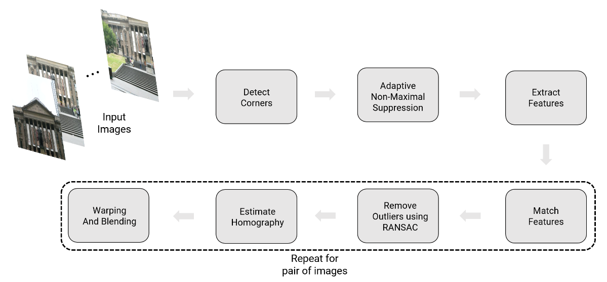
</p>

### Corner Detection

Feature detection is done using Harris Corners on the grayscale version of the color image. All the Harris corners are thresholded and masked to get the truly prominent/probable features in the image. With each corner having a strength value associated with it, they are further passed through an Adaptive Non-Max Suppression Algorithm to filter out duplicate representations of the same corner feature. All the corners with strength greater than the set threshold for a sample image are shown below.

<p align="center">
  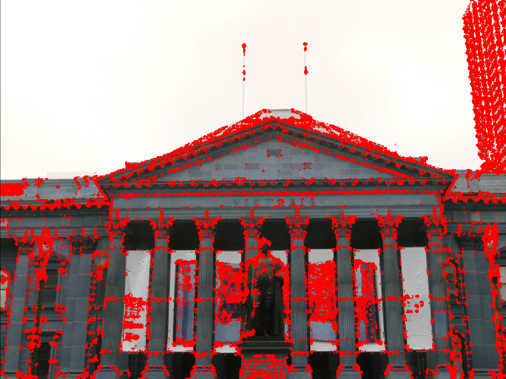
</p>

### Adaptive Non-Maximal Suppression (ANMS)

To filter out duplicates, the local maxima (using the Harris Corner strength) from each area in the image are identified and isolated. To further limit the number of features in the image and avoid too many features having a lot of overlap in their descriptor patches, each feature is associated with an R-value computed using the distance of each feature with the closest neighbor. The features having the highest R-values or are the most isolated are given preference and the ‘N’ most prominent/preferred features are then selected as the final feature set or the given image. The final set of corner features output by the Adaptive Non-Maximal Suppression (ANMS) Algorithm on the same sample image displayed in the previous section is displayed below.

<p align="center">
  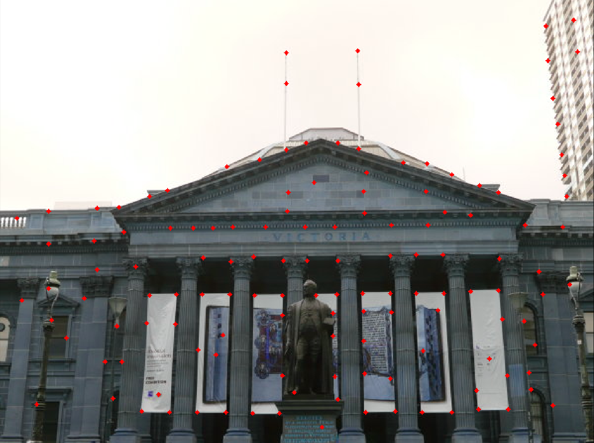
</p>

### Feature Descriptors

For each key point/feature location in the image, a feature descriptor is generated by blurring, downsampling, and reshaping a patch around each feature keypoint location into a fixed-size vector.

### Feature Matching

A brute-force methodology is adopted to match features between images. For each feature in the first image, the sum of squared differences (SSD) between each feature in the second image is computed and ordered. If the SSD ratio between the best and second best match falls within a specified threshold, the match is said to be a good one and added to the set of matched features. All the feature matches detected by using this algorithm on two images with plenty of overlapping features/areas are shown below.

<p align="center">
  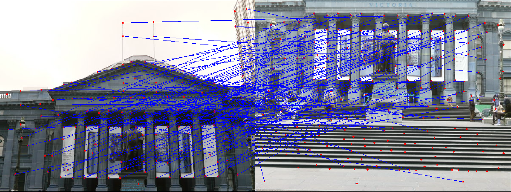
</p>

### RANSAC

The Random Sampling Consensus (RANSAC) algorithm is used to find a reasonable set of matched features to find the best homography from the first to the second image. Over a fixed number of iterations, four matches are randomly sampled and the corresponding homography between them is computed. The norm of the distance between the actual location of the respective features and the homography predicted location is used to classify each of the good matches identified previously as an inlier or not depending on if it falls under a pre-defined threshold. The random sample with the most number of inliers is chosen to calculate the best fitting homography taking into account each of the inliers. The image below displays the final chosen RANSAC matches between the same two sample images. As can be seen, only the truly desirable/correct matches are selected by using an appropriate set of hyperparameters.

<p align="center">
  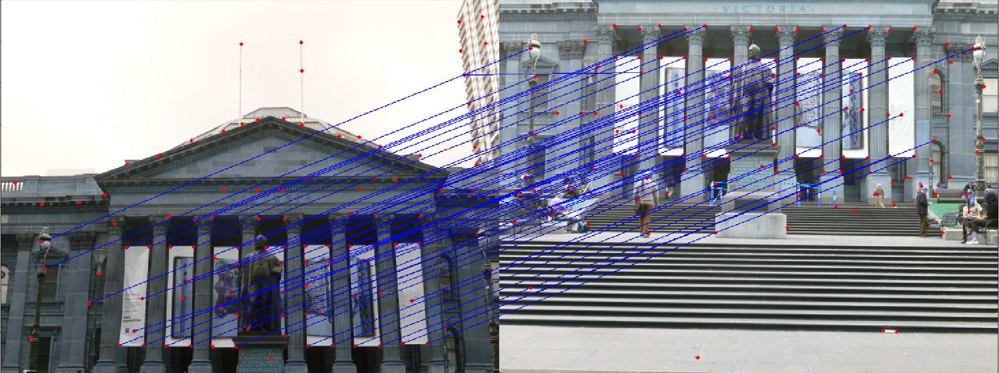
</p>

### Image Warping and Stitching

#### Approach 1

The first approach explored for stitching images together includes sequentially stitching the previous set of images together with the latest image till all images in the set are stitched together into a single panorama.

Using the computed best-fitting homography matrix, the first image is warped to the perspective of the second image to a size bounded by the corner locations of the transformed first image and the corner locations of the second image. The second image is then stitched onto the corresponding appropriate location of the warped/transformed first image.

To stitch together a panorama from a set of individual images, the first image is considered to be the base image. Looping over the rest of the images in the set, the base image is warped to the perspective of the other image and then stitched together. The stitched image is then taken as the base image for the next loop iteration. After stitching together all the images from the set, the final image is smoothed and resized to a desirable shape/size to obtain the final panoramic view from the set of individual images.

Though effective, the downside of this approach is that the differences in brightness and contrast that may occur while stitching two images together may make feature matching in subsequent images harder leading to successive degradation. This method thus works best when there are many features and not much difference in brightness and contrast variation between images in the set.

#### Approach 2

The second approach involves calculating the consecutive homographies between pairs of unstitched/original images. Then using matrix multiplication between consecutive homographies, the tomography between non-consecutive images in the set can be obtained. Thus, by using this idea, one image can consecutively be warped onto the next by calculating the homographies beforehand rather than just before warping. The only disadvantage of this approach is the fact that inaccuracies in tomography calculation propagate through the set and can cause large variations between the actual homographies, especially between images placed far apart from one another in the sequence of the image set. For this reason, leading to worse performances overall than Approach 1, Approach 1 was chosen over Approach 2.

### Results

The final panormaic views of stitching images from a few different sets with overlapping features using the first approach discussed above look as shown below.

<p align="center">
  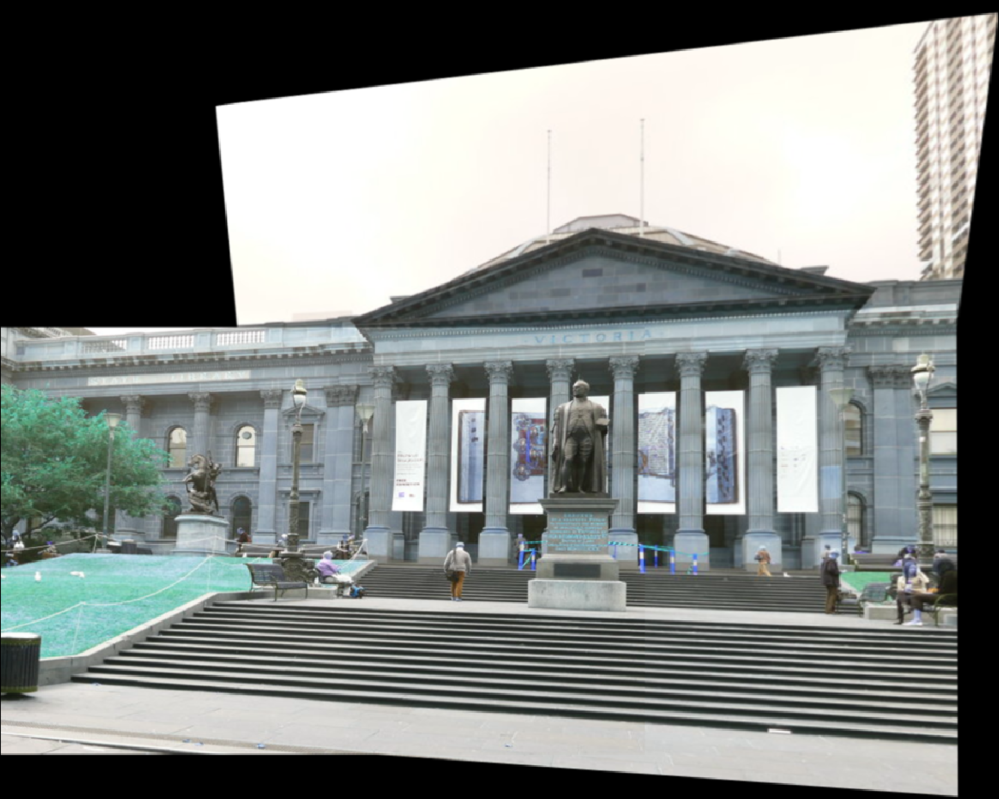
</p>

<p align="center">
  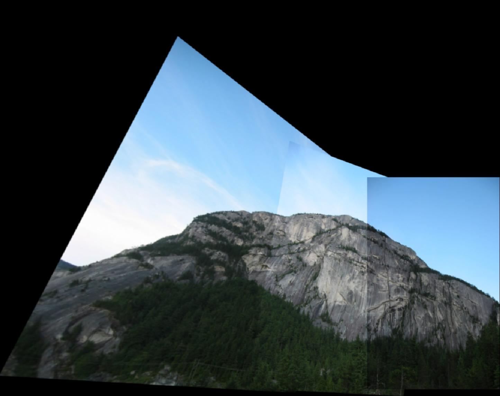
</p>

<p align="center">
  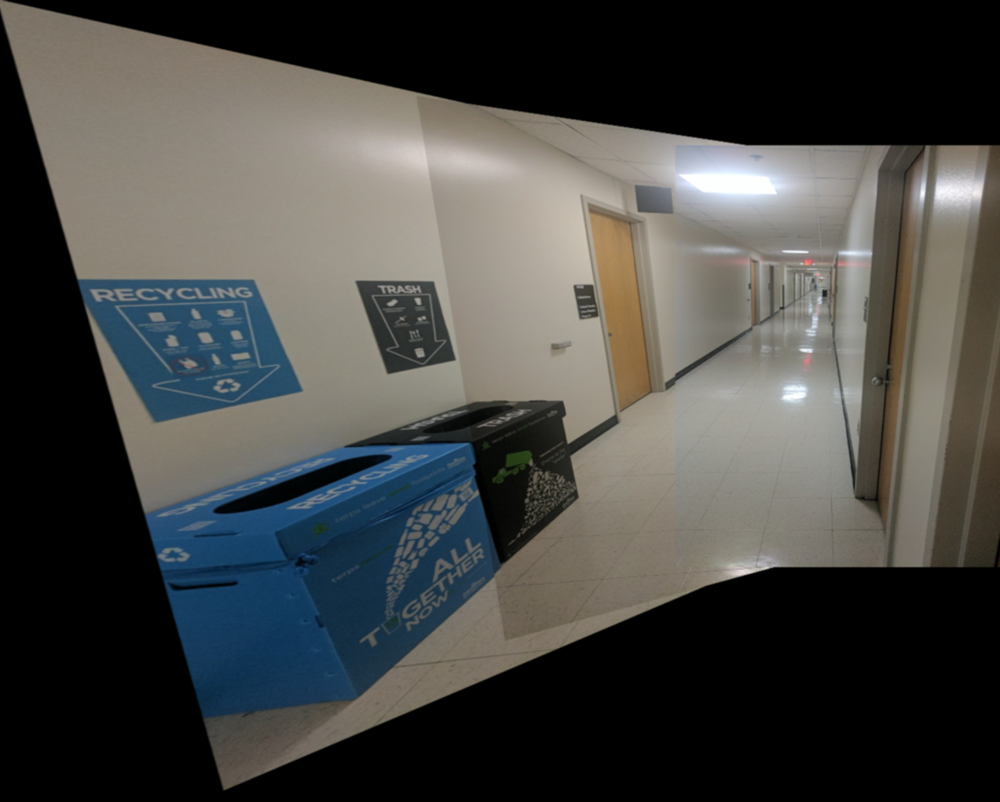
</p>

### Executing the Code

To run the code to generate the panoramic views of images given in a dataset, firstly navigate to the lowest level folder with `Wrapper.py` and directly execute it from the command line.
```sh
cd Phase1/Code/
python3 Wrapper.py
```
However, to run this code, the path to the set of images with overlapping features would need to manually be set by changing the `path_to_images` variable with the appropriate  in line 244 of `Phase1/Code/Wrapper.py`.

## Phase 2: Deep Learning Approach

Deep learning techniques are utilized to calculate the Homography matrix, which represents the transformation between two images. Both supervised and unsupervised learning approaches were used to automate this task. The models are trained to identify the corners of patches and predict the transformation between those patches, which are perturbed to serve as the label set. This approach is referred to as the **4 points parameterization** method.

### Data Generation

This process applies to both supervised and unsupervised
learning models. For our Homography-Net, we require image
pairs as data input. We use 5000 images from the MSCOCO dataset [[reference]](https://arxiv.org/abs/1405.0312). During data generation, we randomly select patches from Image-1, extract four corners from the image, perturb these corners by a perturbation factor of 16, and obtain the warped patch. These patches are then concatenated into channels and fed into the Homography Network.

### Network Model

Initially, we employed the identical network architecture as described in the original HomographyNet paper [[reference]](https://arxiv.org/abs/1606.03798). This architecture bears resemblance to Oxford’s VGG Net, employing 3x3 convolutional blocks alongside BatchNorm and ReLUs. Our network comprises 8 convolutional layers, with a max pooling layer (2x2, stride 2) following every two convolutions. The convolutional layers are configured with the following number of filters per layer: 64, 64, 64, 64, 128, 128, 128, 128. Two fully connected layers follow the
convolutional layers. The initial fully connected layer contains 1024 units. We incorporate dropout with a probability of 0.5 after the final convolutional layer and the first fully-connected layer. The network accepts a two-channel grayscale image sized 128x128x2 as input. The output of this network is predicted H4pt values. An overview of the model and overall deep learning workflow is shown below.

<p align="center">
  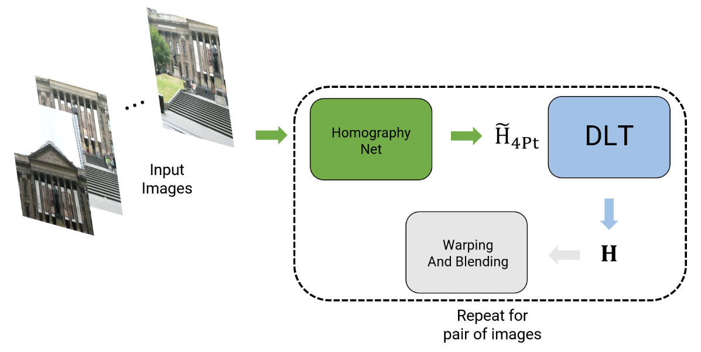
</p>

### Supervised Learning

Within this model, we possess patch A and patch B, from
which we can compute the H4pt matrix, representing the
ground truth. This matrix is then compared with the predicted H4pt matrix, and the Root Mean Squared Error (RMSE) loss is determined through this comparison. The two input images, connected by a homography, are stacked channel-wise and passed through the network. The loss function employed is RMSE loss, and the Adam optimizer is utilized. A learning rate of 0.0001 is used, as decreasing it from 0.001 to 0.0001 led to a significant reduction in loss. Increasing the number of epochs resulted in a substantial reduction in loss over time. The graphic overview of the supervised learning approach is shown in the image below.

<p align="center">
  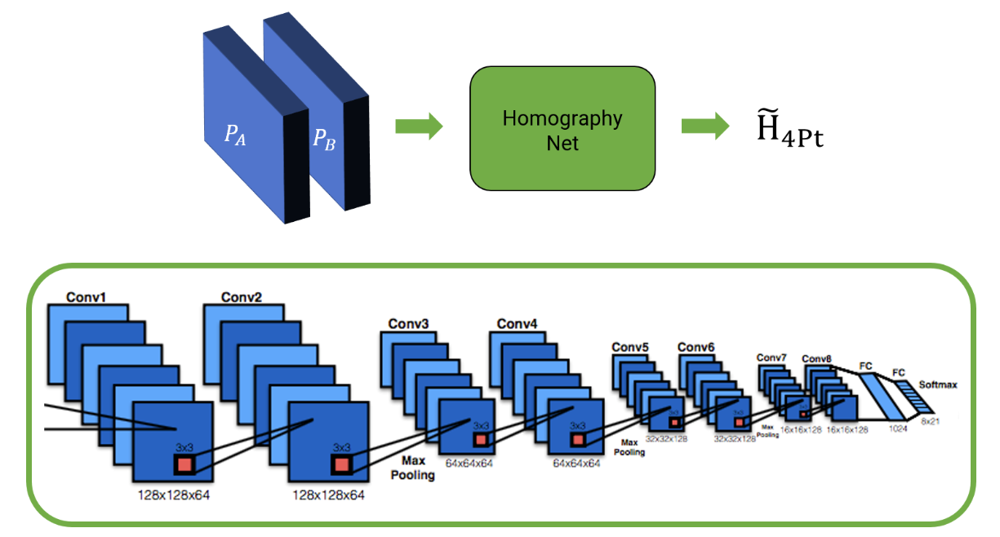
</p>

### Unsupervised Learning

Both supervised and unsupervised deep learning models
were developed, each with its unique characteristics and methods. The supervised model, acknowledging its inherent bias, offers significant potential for improvement. The unsupervised approach utilized data as of supervised and, employing the same architecture as HomographyNet. Following the methodology proposed in ”Unsupervised Deep Homography: A Fast and Robust Homography Estimation Model” [[reference]](https://arxiv.org/abs/1709.03966), the model derives the 3x3 Homography matrix from the H4pt output, ensuring differentiability for gradient propagation through the network. Upon acquiring the 3x3 homography matrix using tensorDLT, the original image is warped through a Spatial Transformer Network (STN) layer to obtain the warped image, facilitating photometric loss calculation against ground truth input data. The graphic overview of the supervised learning approach is shown in the image below.

<p align="center">
  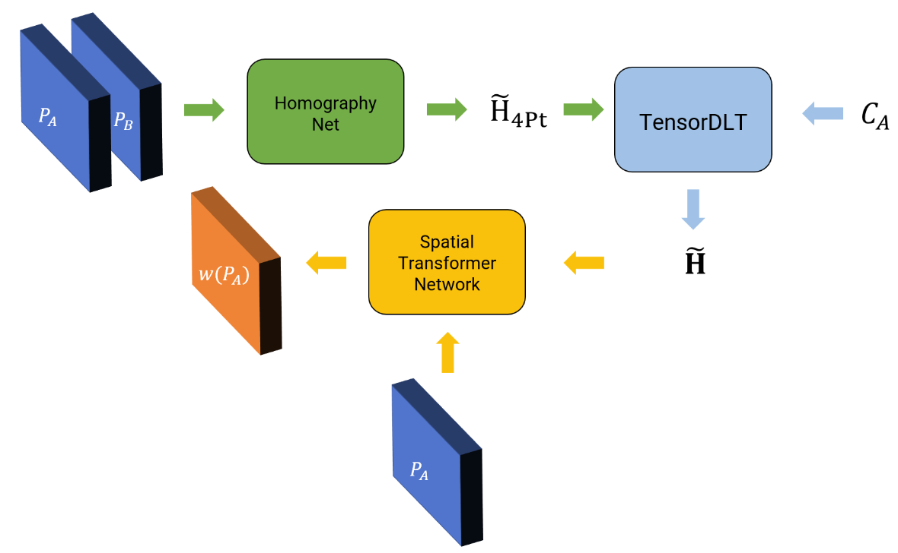
</p>

### Results

The performance of the supervised and unsupervised learning model can be seen in the images below by comparing the position, shape, and size of the ground-truth (in red) and model predicted (in blue) patches. The top/left image corresponds to the supervised learning model whereas the bottom/right image corresponds to the unsupervised learning model.

<p align="center">
  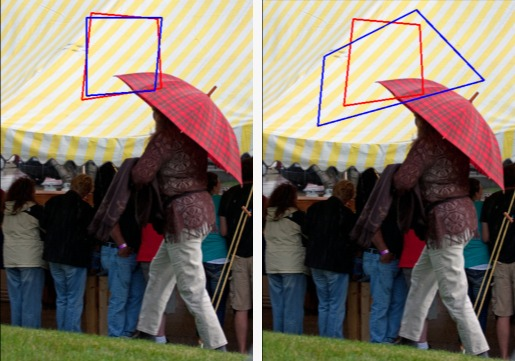
</p>

<p align="center">
  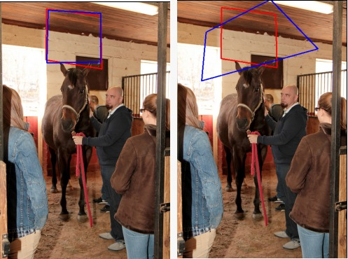
</p>

<p align="center">
  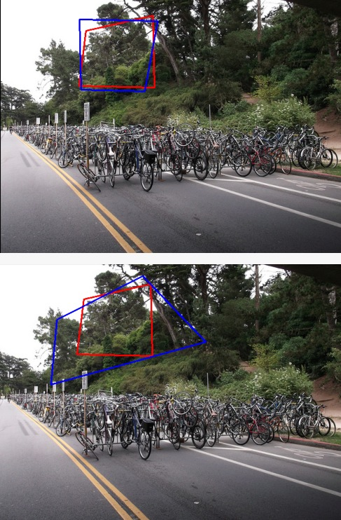
</p>

<p align="center">
  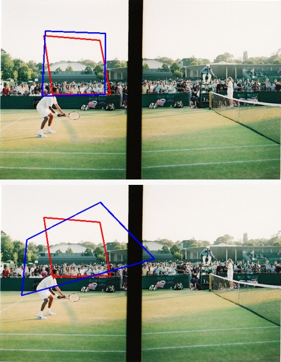
</p>

As can be seen, the supervised learning converges to really good performance and makes a good model for approximating the homography between two image patches. The unsupervised learning method also captures a good homography estimation with respect to translation/position but tends to overfit with rtegard to shape. This can be attributed to a lack of enough data for the network to learn generalized homographies. More data and training would aid in recreating the original results of the paper.

### Executing the Code

To train the network, first we need to generate the synthetic data required to train such homography networks. To do that use the `Wrapper.py` script provided. Make sure you've downloaded both the train and test datasets for this to work and have placed the datasets under the Phase2/Data folder.

```bash
# To generate synthetic data
$ python3 Phase2/Code/Wrapper.py
```

Now to train the network, select the type of network you want to train, both options are given below. For more arguments, check out the `Train.py` file. To test the network, use the `Test.py` file after training both networks. 

Note - For all the files, make sure you have pytorch installed preferably in a CUDA environment for the least errors.

```bash
# To train the supervised network 
$ python3 Phase2/Code/Train.py --NumEpochs 25 --ModelType Sup

# To train the unsupervised network 
$ python3 Phase2/Code/Train.py --NumEpochs 25 --ModelType UnSup

# To test the networks
$ python3 Phase2/Code/Test.py   
```
To change the model architecture, the model imported from `Network.py` and other paths in `Train.py` and `Test.py` would need to be changed accordingly.

*****************************************************

**NOTE**: To run and execute any code (especially in Phase 2), it is extremely necessary to have appropriate data and result paths. Contact the authors for the datasets.

You can also refer more  implementation details in `Report.pdf`.

This project was made possible with the guidance and support of Dr. Yiannis Aloimonos from the University of Maryland. The images for the workflows in both phases were taken from [this](https://cmsc733.github.io/2022/proj/p1/) webpage.